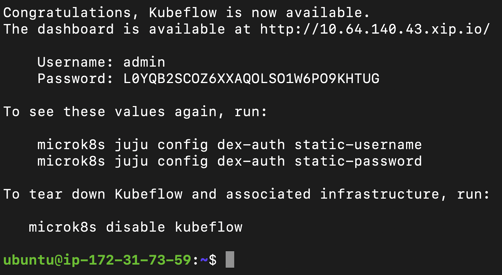

## 1. Overview
Kubeflow is a novel open source tool for Machine Learning workflow orchestration on Kubernetes.
It has great powers, but deploying it may not be so easy, depending on how and where you deploy
your Kubernetes. This tutorial will show you an easy way to deploy Kubeflow using MicroK8s, a
lightweight version of Kubernetes, in a few simple steps.

### What you'll learn

* How to deploy MicroK8s on Ubuntu
* How to deploy Kubeflow using MicroK8s
* How to access your Kubeflow dashboard

### What you'll need
* Desktop or Virtual Machine with Ubuntu 16.04 or above
* A minimum of 4 CPU, 14GB RAM, 50GB Disk (recommended 8 CPU, 16GB RAM, 60GB Disk)
* Some basic command-line knowledge
* If installing on Windows or MacOS, see the MicroK8s docs for OS-specific requirements:
  <https://microk8s.io/docs/install-alternatives> 

## 2. Install MicroK8s

To install MicroK8s, follow the installation instructions for your platform at
https://microk8s.io/docs/.

## 3. Deployment

Now we are able to deploy all the Kubernetes services behind Kubeflow. To do this we just need
to:

1. Deploy Kubeflow using:

       microk8s enable kubeflow

1. Wait several minutes for all services to be deployed. Do not interrupt this process. We can
   follow the progress with the following command:

       microk8s kubectl get all --all-namespaces

1. Congratulations! We have made it! We can see the following prompt:

**

## 4. Access Kubeflow dashboard

Once deployed, now it is time to access the Kubeflow dashboard, so we can play around with it. Run
this command to ensure the dashboard is enabled:

    microk8s enable dashboard

### Option 1: On Ubuntu desktop
If running Ubuntu locally, open a new browser window and access the link given in the previous step.
In our example, this link is http://10.64.140.43.xip.io/.

### Option 2: On a VM or Multipass
If running Ubuntu on a virtual machine somewhere else, we need to create a SOCKS proxy. This can be
done as follows:

1. Logout from current session.

1. Re-establish a connection to the machine using `ssh`, enabling a SOCKS proxy. Examples:

       ssh -D9999 ubuntu@<machine_public_ip>
       ssh -D9999 multipass@<machine_public_ip>

1. On your computer, go to `Settings > Network > Network Proxy`, and enable the SOCKS proxy pointing
   to `127.0.0.1:9999`.

1. On a new browser window, access the link given in the previous step. In our example, this link is
   http://10.64.140.43.xip.io/.

## 5. That's all! Enjoy Kubeflow!

Congratulations!

To know more about Kubeflow visit:
* kubeflow.org
* ubuntu.com/kubeflow

For further help, visit:
* ubuntu.com/kubeflow/consulting
