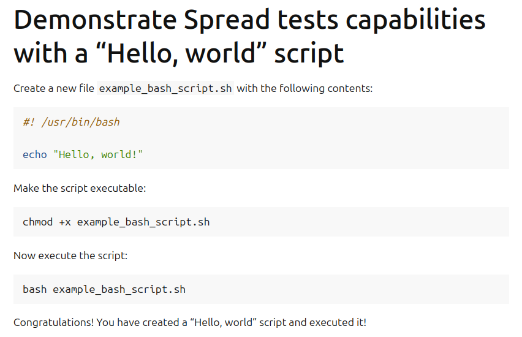

Set up automated testing for a Sphinx-based tutorial
====================================================

When crafting a tutorial, you may want to check that all the steps
run smoothly and as expected. You can accomplish this with
**Spread** -- a system-wide test distribution that automatically assigns jobs to run
tests in GitHub CI workflows. Using Spread, you can create a **Spread
test** that runs through all the steps in your tutorial and outputs
any failures that may occur. And with Sphinx-based directives, you can guarantee that
your tutorial uses the same commands that Spread is testing.

.. note::

    Creating a Spread test for your tutorial is not required to use
    the Sphinx starter pack; this is an optional capability.

**What you'll need**

* `Multipass <https://multipass.run/install>`_ installed on your machine 
* `Spread <https://github.com/canonical/spread>`_ installed on your machine

**What you’ll do**

* Create a "Hello, world" Spread test called ``example_tutorial``
* Run the Spread test locally on your machine using Multipass

Create the Spread test materials
--------------------------------

On your local machine, create a new directory called ``spread_test_example``
and change into it. This is the root directory of your example project.

Inside the ``spread_test_example`` directory, create the ``tests`` directory
using ``mkdir tests`` and change into it. This directory can hold materials for multiple
Spread tests. 

Under the ``tests`` directory, create a new directory ``example_tutorial``
to store the files for a "Hello, world" Spread test. This test consists of two files:

* A bash script that echoes "Hello, world" to the terminal.
* A ``task.yaml`` file that contains all the commands you want the Spread test to run.

In ``spread_test_example/tests/example_tutorial``, run this command to create a file
named ``example_bash_script.sh``:

.. code-block::

    echo -e '#! /usr/bin/bash\n\necho "Hello, world!"' > example_bash_script.sh 

Now let's create a ``task.yaml`` file. This file holds all the commands the
user will run in your tutorial.

In ``spread_test_example/tests/example_tutorial``, paste the following contents
into a new file ``task.yaml``:

.. code-block:: yaml

    ###########################################
    # IMPORTANT
    # Comments matter!
    # The docs use the wrapping comments as
    # markers for including said instructions
    # as snippets in the docs.
    ###########################################
    summary: Example tutorial

    kill-timeout: 5m

    execute: |
      # [docs:make-bash-executable]
      chmod +x example_bash_script.sh
      # [docs:make-bash-executable-end] 

      # [docs:execute-bash-script]
      bash example_bash_script.sh
      # [docs:execute-bash-script-end] 

The ``summary`` section contains a brief description of your tutorial, and
the ``execute`` section contains all the commands that your tutorial uses.
The ``kill-timeout`` option has a default of 10 minutes and doesn't need to be
included if your test will complete in that time frame. 

By wrapping commands with comments in the form of
``# [docs:example-wrapping-command]`` and ``# [docs-example-wrapping-command-end]``,
we can include the exact commands from ``task.yaml`` in the tutorial file.

Create the tutorial file
------------------------

Now we have everything we need to create the tutorial file itself.
`ReStructuredText (.rst)`_ is used for the tutorial file format; `MyST-Markdown`_
can also be used. 

In ``spread_test_example/tests/example_tutorial``, create a text file
named ``example_tutorial.rst``. To add a title for your tutorial, copy the
block below to this file. 

.. code-block:: rst

    Demonstrate Spread tests capabilities with a "Hello, world" script
    ==================================================================

In this file, we can use Sphinx's ``literalinclude`` directives
to feed the Spread test materials directly into our tutorial. This way, we guarantee
that the Spread test is testing the exact commands that appear in the tutorial. 

Let's start with the bash script. In the mock tutorial, we want the the reader to
create the file themselves, so let's use that language in ``example_tutorial.rst``
when we include the script. Add the following text below the title:

.. code-block:: rst
  :emphasize-lines: 4-7

  Demonstrate Spread tests capabilities with a "Hello, world" script
  ==================================================================

  Create a new file ``example_bash_script.sh`` with the following contents:

  .. literalinclude:: example_bash_script.sh
      :language: bash

Here, we specified that the language of the script is ``bash``. Since our
tutorial file and the example bash script are located in the same directory,
we don't need to specify where the script is located when we use ``literalinclude``.

At the end of the ``example_tutorial.rst`` file, insert the two commands that
appear in our ``task.yaml`` file, again using the ``literalinclude`` directive:

.. code-block:: rst
  :emphasize-lines: 9-25

  Demonstrate Spread tests capabilities with a "Hello, world" script
  ==================================================================

  Create a new file ``example_bash_script.sh`` with the following contents:

  .. literalinclude:: example_bash_script.sh
      :language: bash  

    Make the script executable:

  .. literalinclude:: task.yaml
      :language: bash
      :start-after: [docs:make-bash-executable]
      :end-before: [docs:make-bash-executable-end]
      :dedent: 2

  Now execute the script:

  .. literalinclude:: task.yaml
      :language: bash
      :start-after: [docs:execute-bash-script]
      :end-before: [docs:execute-bash-script-end]
      :dedent: 2

  Congratulations! You have created a "Hello, world" script and executed it!

If you were to render the tutorial file using Read The Docs, then the page would
look like the following:

Create the Spread test
----------------------

Now let's create the Spread test file and include our example tutorial. From the
``spread_test_example`` directory, create the file ``spread.yaml`` and insert the
following contents:

.. code-block:: yaml

    project: spread_test_example

    path: /spread_test_example

Note that the ``project`` name matches the main directory's name,
``spread_test_example``. The ``path`` designates the directory where the Spread
materials exist.

Now we need to tell Spread about the ``example_tutorial`` Spread test. Add the
following section to the end of ``spread.yaml``:

.. code-block:: yaml
    :emphasize-lines: 5-9

    project: spread_test_example

    path: /spread_test_example

    suites:
      tests/:
        summary: example tutorial
        systems:
        - ubuntu-24.04.64

The ``suites`` section is how we tell Spread about the various Spread tests in
our project. We tell Spread to look in the ``tests`` directory for all Spread tests
(which it will only find one, ``example_tutorial``). We also use the ``suites``
section to tell Spread about the systems we want Spread to test.
For our mock tutorial, we will use Ubuntu 24.04. 

Configure the Spread test to use Multipass
------------------------------------------

Each job in Spread has a backend, or a way to obtain a machine on which to run
your Spread test. The `Spread repository <https://github.com/canonical/spread>`_ contains
more information on backends like Google or QEMU, but let's set up Multipass as
a backend to run local tests. 

Include the following ``backends`` section of ``spread.yaml`` between the ``path`` and
``suites`` sections:

.. code-block:: yaml
    :emphasize-lines: 5-40

    project: spread_test_example

    path: /spread_test_example  

    backends:
      multipass:
        type: adhoc
        allocate: |
          multipass_image=24.04
          instance_name="example-multipass-vm"

          # Launch Multipass VM
          multipass launch --cpus 2 --disk 10G --memory 2G --name "${instance_name}" "${multipass_image}"

          # Enable PasswordAuthentication for root over SSH.
          multipass exec "$instance_name" -- \
            sudo sh -c "echo root:${SPREAD_PASSWORD} | sudo chpasswd"
          multipass exec "$instance_name" -- \
            sudo sh -c \
            "if [ -d /etc/ssh/sshd_config.d/ ]
            then
              echo 'PasswordAuthentication yes' > /etc/ssh/sshd_config.d/10-spread.conf
              echo 'PermitRootLogin yes' >> /etc/ssh/sshd_config.d/10-spread.conf
            else
              sed -i /etc/ssh/sshd_config -E -e 's/^#?PasswordAuthentication.*/PasswordAuthentication yes/' -e 's/^#?PermitRootLogin.*/PermitRootLogin yes/'
            fi"
          multipass exec "$instance_name" -- \
            sudo systemctl restart ssh

          # Get the IP from the instance
          ip=$(multipass info --format csv "$instance_name" | tail -1 | cut -d\, -f3)
          ADDRESS "$ip"

        discard: |
          instance_name="example-multipass-vm"
          multipass delete --purge "${instance_name}"

        systems:
          - ubuntu-24.04-64:
              workers: 1

    suites:
      tests/:
        summary: example tutorial
        systems:
        - ubuntu-24.04.64

The ``backends`` section contains the following sections:

* The backend is designated as ``type: adhoc`` as we are explicitly
  scripting the procedure to allocate and discard the Multipass VM. 
* In the ``allocate`` section, we define the image and name of the VM, launch the
  VM, and then set up the proper SSH permissions so that Spread can log in (via root)
  into the VM and insert the Spread test. We also must tell Spread about the
  IP address of the Multipass VM and set the environment variable ``ADDRESS``.
* In the ``discard`` section, we delete the Multipass VM once the Spread test
  has finished running.

Run the Spread test locally
---------------------------

List all available Spread tests in the code repository:

.. code-block:: bash

    spread --list

The terminal should respond with a single line representing the
test for ``example_tutorial``:

.. terminal::
    :dir: spread_test_example
    :input: spread --list

    multipass:ubuntu-24.04-64:tests/example_tutorial 

Now let's run the Spread test for ``example_tutorial``:

.. code-block:: bash

    spread -vv -debug multipass:ubuntu-24.04-64:tests/example_tutorial

The test can take several minutes to complete. The ``-vv -debug`` flags
provide useful debugging information as the test runs.

Validate the Spread test results
--------------------------------

The terminal will output various messages about allocating the Multipass VM,
connecting to the VM, sending the Spread test to the VM and executing the test.
If the test is successful, the terminal will output something similar to the following:

.. terminal::

    2025-02-04 16:17:10 Successful tasks: 1
    2025-02-04 16:17:10 Aborted tasks: 0

Another sign of a successful test is whether the Multipass VM was deleted as expected.
We can check by running ``multipass list``, and if the Spread test was successful
(and you have no other Multipass VMs created at the time), the terminal should
respond with the following:

.. terminal::
    :dir: spread_test_example
    :input: multipass list

    No instances found.

If the Spread test failed, then the ``-debug`` flag will open a shell into the
Multipass VM so that additional debugging can happen. In that case, the terminal
will output something similar to the following:

.. terminal::

    2025-02-04 16:17:10 Starting shell to debug...
    2025-02-04 16:17:10 Sending script for multipass:ubuntu-24.04-64 (multipass:ubuntu-24.04-64:tests/example_tutorial):

Next steps
----------

Congratulations! You set up the materials needed to run a Spread test locally using
Multipass with commands that explicitly appear in a Sphinx-based tutorial. This
section provides additional examples of Spread tests: 

* `Spread tests included in Rockcraft documentation <https://github.com/canonical/rockcraft/tree/main/docs/tutorial/code>`_
* `Spread tests included in Charmcraft documentation <https://github.com/canonical/charmcraft/tree/main/docs/tutorial/code>`_

.. wokeignore:rule=master
.. _ReStructuredText (.rst): https://www.sphinx-doc.org/en/master/usage/restructuredtext
.. _MyST-Markdown: https://myst-parser.readthedocs.io/en/latest